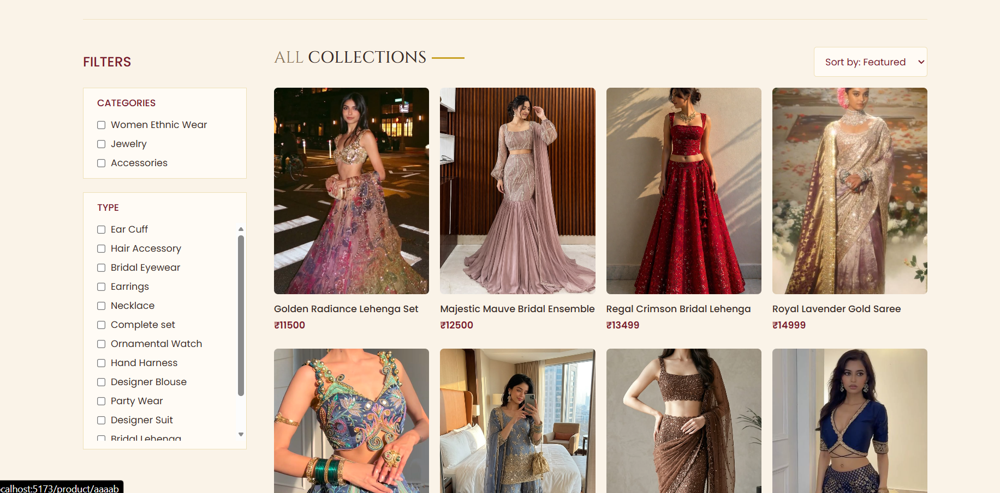

#  E-Commerce Website


A full-stack e-commerce website built with modern web technologies.  
The project includes a customer-facing shopping website and a separate admin dashboard to manage products and orders.

---

##  Features

##  Customer Website

- User-friendly shopping interface
- Browse products
- Product details
- Add to cart
- Update cart quantity
- Checkout process
- Place orders
- Order history
- Fully responsive design

---

##  Admin Dashboard

- Secure admin login
- Dashboard overview
- Add new products
- Upload product images
- Manage product listings
- View orders
- Manage order status

---

#  Tech Stack

## Frontend

- React.js
- Vite
- Tailwind CSS
- React Router
- Axios

## Admin Panel

- React.js
- Tailwind CSS
- Context API

## Backend

- Node.js
- Express.js
- MongoDB
- Mongoose

## Third Party Services

- MongoDB Atlas
- Cloudinary

---

#  Project Structure

```
E-Commerce Website

│
├── frontend
│   └── Customer Shopping Website
│
├── admin
│   └── Admin Dashboard
│
└── backend
    └── API Server
```

---

#  Installation

Clone the repository:

```bash
git clone YOUR_REPOSITORY_LINK
```

Navigate into the project:

```bash
cd "E-Commerce Website"
```

---

# Frontend Setup

```bash
cd frontend

npm install

npm run dev
```

---

# Admin Setup

```bash
cd admin

npm install

npm run dev
```

---

# Backend Setup

```bash
cd backend

npm install

npm run server
```

---

#  Environment Variables

Create a `.env` file inside backend:

```
MONGODB_URI=your_mongodb_connection_string

CLOUDINARY_NAME=your_cloudinary_name
CLOUDINARY_API_KEY=your_cloudinary_key
CLOUDINARY_SECRET_KEY=your_cloudinary_secret

JWT_SECRET=your_secret_key
```

---

# 📸 Screenshots

## Home Page


## Collection Page




## About Page


---

#  Future Improvements

- Online payment integration
- Wishlist functionality
- Product reviews
- Advanced search and filtering
- Deployment

---

#  Author

**Nandini Vasudev**

Full Stack E-Commerce Project